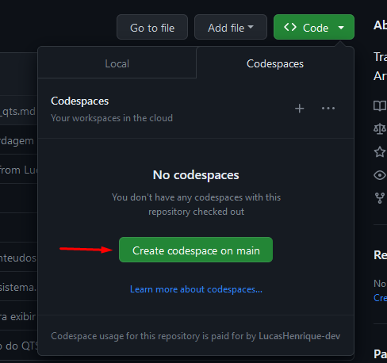

# ⚙️📊 Gerador Gráfico de Relatório


## ℹ Tabela de Conteúdos
- [Descrição do Projeto](#dart-projeto-da-cadeira-de-compiladores-20222)
- [Especificações](#-especificações-do-projeto)
- [Como Usar](#-como-usar-a-dsl-no-codespaces)

## :dart: Projeto da Cadeira de Compiladores 2022.2

O projeto se propõe a criar uma DSL (Domain Specific Language). A atividade contribuirá para a consolidação da aprendizagem teórica da disciplina, onde iremos implementar o Frontend e Backend de uma linguagem.
A motivação por trás da construção dessa DSL é criar uma linguagem de alto nível, responsável por abstrair detalhes de implementação de consultas SQL em arquivos Excel (.xlsx).

## 📃 Especificações do Projeto

Especificações incluem:
- Frontend do Compilador
- Backend do Compilador

Visualize as especificações do projeto: [Especificações Gerador Gráfico de Relatório](especificacoes)

## ☕ Como Usar a DSL no Codespaces

Para usar a DSL, siga estas etapas:

1. Crie um codespace:
    * Clique em "Code" e depois na opção "Create codespace on <branch>", onde <branch> é a branch em que se está trabalhando no momento </br>
    
1. Compilar a descrição da linguagem fonte:
    * Use o seguinte comando
      ```shell
      java -jar antlr.jar -o src-gen GeradorRelatorio.g4
      ```
      > O comando acima executa o gerador ANTLR que converte a descrição da gramática (Expr.g4) em programas Java (Analisadores léxicos e sintáticos). Os códigos dos analisadores gerados serão armazendados na pasta src-gen.
1. Compilar programas em Java:
   * Use o seguinte comando
      ```shell
      javac -cp antlr.jar:fillo.jar:. -d classes src/*.java src-gen/*.java
      ```
      > O comando acima executa o compilador Java. O arquivo antlr.jar, que contem as bibliotecas runtime utilizadas pelo código gerado pelo antlr são adicionadas ao CLASSPATH, assim como fillo.jar para poder utilizar a API de Excel para Java. O compilador compila todos os arquivos java que estão no diretório "src" (arquivo escritos pelo programador) e no diretório "src-gen" (arquivos gerados automáticamente). Os arquivos binários compilados gerados pelo javac serão armazenados no diretório classes.

1. Executar o programa:
   * Use o seguinte comando
     ```shell
     java -cp antlr.jar:fillo.jar:classes Main
     ```
     > O comando acima executa a classe Main do compilador. Os arquivos binários das classes estão localizades no diretório "classes". Para a classe poder ser executada é necessário também incluir os arquivos do runtime do antlr.jar e fillo.jar.

</br>
   
- Caso o objetivo seja apenas testar dados de entrada do sistema, altere o arquivo `input.txt` com a entrada o qual deseja testar e realize o 4° passo do fluxo principal.
- Caso haja nescessidade de alterar algo na `Main.java`, realize os passos 3 e 4 do fluxo principal. Além disso, pode-se usar os seguintes comandos para simplificar a execução do projeto:
   1. Configurar permissões do projeto:
      * Use o seguinte comando
        ```shell
        chmod 777 ./EXECUTEME.sh
        ```
        > O comando acima permite o usuário ler, escrever e executar o arquivo EXECUTEME.sh o qual encapsula os comandos dos passos 3 e 4 do fluxo principal.
   1. Executar o programa:
      * Use o seguinte comando
        ```shell
        ./EXECUTEME.sh
        ```
        > O comando acima permitirá testar a DSL implementada.
   
- Caso haja alterações na gramática do sistema, `GeradorRelatorio.g4`, realize os passos 2, 3 e 4 do fluxo principal.

## 📝 Licença

Esse projeto está sob licença. Veja o arquivo [LICENÇA](LICENSE) para mais detalhes.

[⬆ Voltar ao topo](#%EF%B8%8F-gerador-gráfico-de-relatório)<br>
