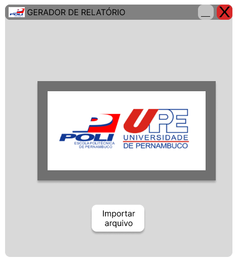
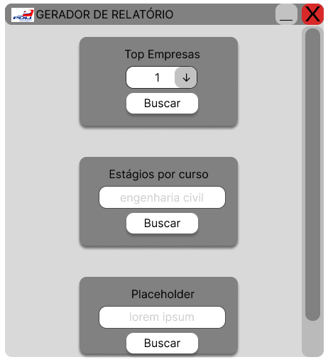
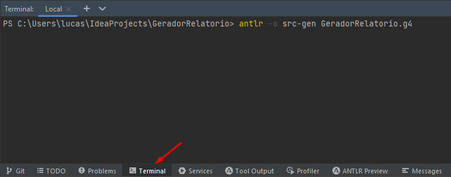
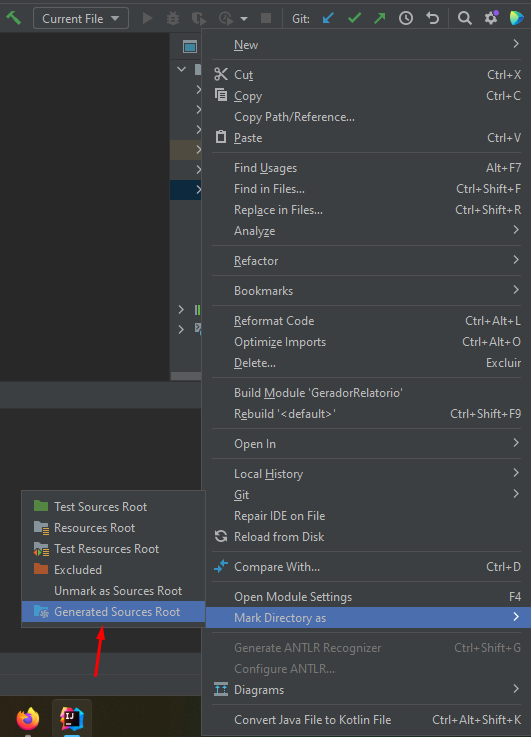

# ⚙️📊 Gerador Gráfico de Relatório


## ℹ Tabela de Conteúdos
- [Descrição do Projeto](#dart-projeto-da-cadeira-de-compiladores-20222)
- [Especificações](#-especificações-do-projeto)
- [Protótipo do Projeto - Figma](https://www.figma.com/proto/hDs7IpLgYHRi0fEVKPUU5L/PROJETO-DSL?node-id=31-4&scaling=min-zoom&page-id=0%3A1&starting-point-node-id=31%3A4)

## :dart: Projeto da Cadeira de Compiladores 2022.2

O projeto se propõe a criar uma DSL (Domain Specific Language). A atividade contribuirá para a consolidação da aprendizagem teórica da disciplina, onde iremos implementar o Frontend e Backend de uma linguagem. 

<div align="center">

  
  </br>
  
</div>

> Telas da Linguagem de Domínio Específico.

## 📃 Especificações do Projeto

Especificações incluem:
- Frontend do Compilador
- Backend do Compilador

Visualize as especificações do projeto: [Especificações Gerador Gráfico de Relatório](especificacoes)

## ☕ Como Usar a DSL no Intellij

Para usar a DSL, siga estas etapas:

1. Faça o Download do ANTLR:
    * Navegue até o site do [ANTLR](https://www.antlr.org/) e realize o Download da versão desejada. </br>
    Este tutorial no Youtube ajuda no processo: [ANTLR Set up for Loading Parse Tree | Windows | English Tutorial](https://www.youtube.com/watch?v=p2gIBPz69DM)
1. Clone este Projeto:
    * Use o comando para clonar o projeto
      ```git
      git clone https://github.com/LucasHenrique-dev/gerador-relatorio.git
      ```
1. Gerar os Arquivos Java:
   * Abra o projeto no Intellij
   * No terminal, digite:
      ```shell
      antlr -o src-gen GeradorRelatorio.g4
      ```
      > O ANTLR se encarrega de executar o arquivo `GeradorRelatorio.g4` e gera arquivos java necessários para a gramática dada. (Destino dos arquivos é uma pasta chamada `src-gen`
      
     
 1. Configurar Diretório:
     * Localize o diretório `src-gen` na aba de projetos e clique com o botão direito do mouse
     * Selecione a opção `Mark Directory as` e depois clique em `Sources root`
     
 1. Executar código:
     * Após essas configurações, basta editar a Main do diretório `src` e executar normalmente pelo Run
     
## 📝 Licença

Esse projeto está sob licença. Veja o arquivo [LICENÇA](LICENSE) para mais detalhes.

[⬆ Voltar ao topo](#%EF%B8%8F-gerador-gráfico-de-relatório)<br>
